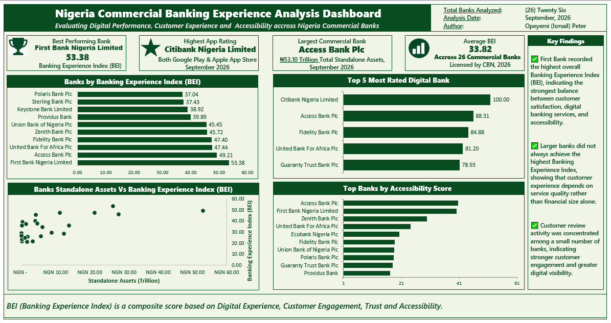
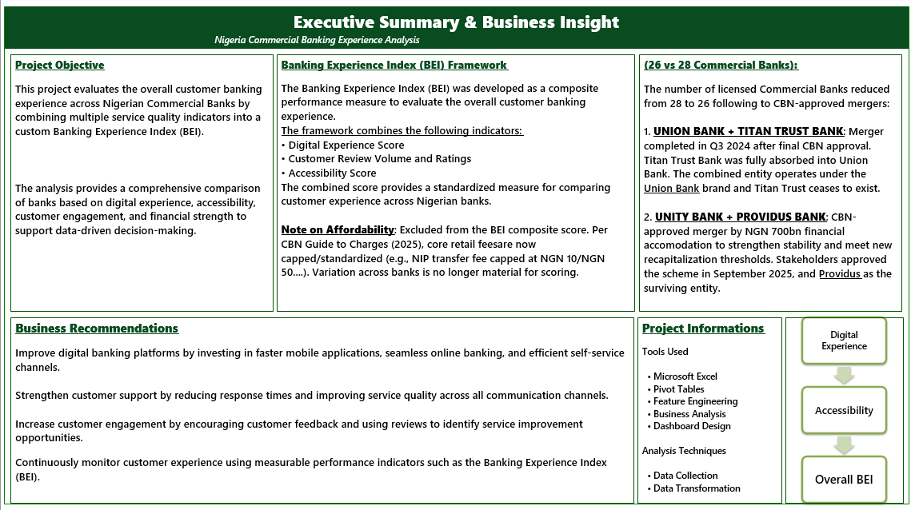
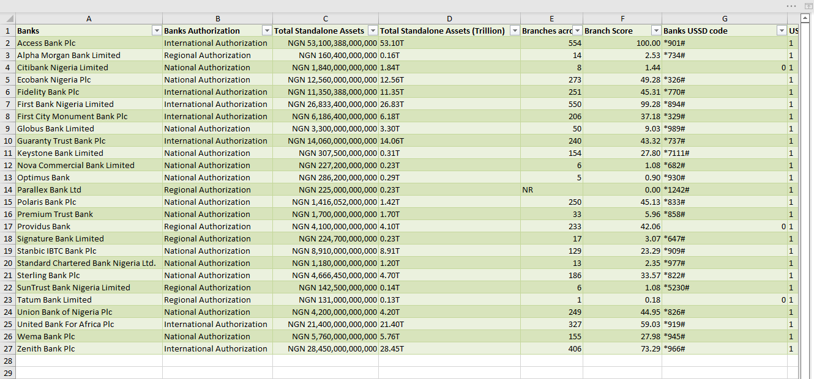
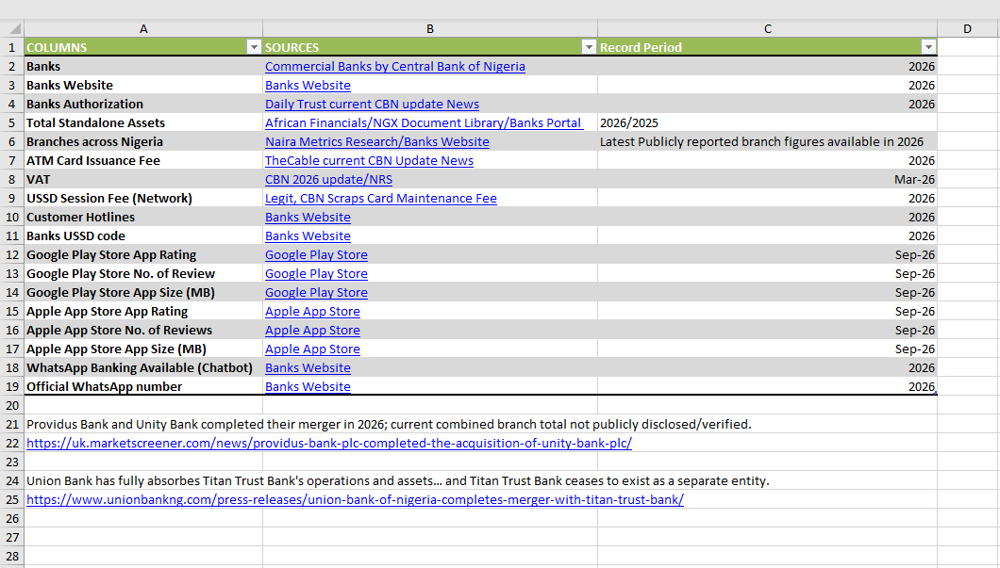

# 🇳🇬 Nigeria Commercial Banking Experience Analysis

> A comprehensive Microsoft Excel project evaluating the customer banking experience across Nigerian Commercial Banks using a custom Banking Experience Index (BEI).

---

## 📌 Project Overview

This project analyzes the overall customer banking experience across Nigerian commercial banks (licensed by CBN 2026) by combining multiple customer-focused performance indicators into a single Banking Experience Index (BEI).

Unlike traditional banking comparisons that focus only on financial performance, this analysis evaluates how customers actually experience banking services through mobile banking quality, accessibility and digital performance.

The project was completed entirely using Microsoft Excel with additional feature engineering techniques to transform raw information into actionable business insights.

---

## 🎯 Business Objective

The primary objective of this project is to identify which Nigerian commercial banks provide the best overall customer banking experience.

The analysis helps answer questions such as:

- Which bank delivers the best overall customer experience?
- Does a larger bank automatically provide a better customer experience?
- Which banks perform best in digital banking?
- Which banks is the most rated bank by customers?
- How does customer engagement differ across banks?

---

# 🗂 Data Sources

The dataset was manually compiled from multiple credible public sources including:

- Central Bank of Nigeria (CBN)
- Banks Tariff Guide to Charges 2026
- Nigerian Exchange Group (NGX)
- Official Bank Websites
- Official Branch Locators
- Google Play Store
- Apple App Store

This approach ensured the analysis reflects publicly available and verifiable information rather than relying on a single downloaded dataset.

---

# 📚 Data Dictionary

The project documents every variable together with its official data source.

Examples include:

- Total Standalone Assets
- Branches
- App Rating (Google Play & Apple App Store)
- Number of Reviews ( Google Play & Apple App Store)
- USSD Codes
- USSD Session Fee (Network)
- Card Issuance Fees
- Whatsapp banking Available 
- Official Whatsapp Number 
- Customer Care Hotlines
- ...............
---

# ⚙ Feature Engineering

To make the analysis more meaningful, several custom scoring metrics were developed.

These include:

- ⭐ Rating Score
- ⭐ Review Score
- ⭐ Overall Ratings 
- ⭐ Digital Experience Score
- ⭐ Accessibility Score 
- ⭐ Banking Experience Index (BEI)

The Banking Experience Index combines multiple customer experience indicators into a single performance score for comparison across all banks.

---

# 📈 Dashboard Features

The dashboard includes:

- Executive KPI Cards
- Top 10 Banks by Banking Experience Index
- Most Rated Digital Bank
- Digital Experience Score Comparison
- Customer Review Volume Analysis
- Relationship Between Bank Size and Customer Experience (Scatter Plot)
- Executive Business Insights

---

# 📊 Dashboard Preview

> Dashboard



---

> 📄 Executive Summary



---

# 💡 Key Insights

Some major findings from the analysis include:

- First Bank Nigeria Limited recorded the highest overall Banking Experience Index (BEI).
- Strong digital banking performance is closely associated with higher customer experience.
- Financial size does not always translate into superior customer experience.

---

# 🛠 Tools Used

- Microsoft Excel
- Pivot Tables
- Pivot Charts
- Feature Engineering
- Business Analysis
- Dashboard Design

---

# 📁 Repository Structure

```
Nigeria-Major-Banking-Experience-Analysis
│
├── Data
│   ├── Raw Dataset.xlsx
│   ├── Analysis Model.xlsx
│
├── Dashboard
│   ├── Dashboard.png
│   ├── Executive Summary.png
│
├── Documentation
│   ├── Data Dictionary.xlsx
│
├── README.md
```

---

# 📷 Project Screenshots

## Dashboard


---

## Executive Summary


---

## Analysis Model



---

## Data Dictionary



---

# 🚀 Business Value

This project demonstrates how Microsoft Excel can be used to transform raw banking information into meaningful business intelligence that supports data-driven decision-making.

The methodology can easily be extended to evaluate customer experience across other industries such as telecommunications, insurance, fintech and e-commerce.

---

# 👨‍💻 Author

**Opeyemi (Ismail) Peter**

Data Analyst | Business Intelligence

GitHub:
https://github.com/Cephasia

LinkedIn:
https://www.linkedin.com/in/cephasia

---

⭐ If you found this project interesting, feel free to star the repository and follow the author.
